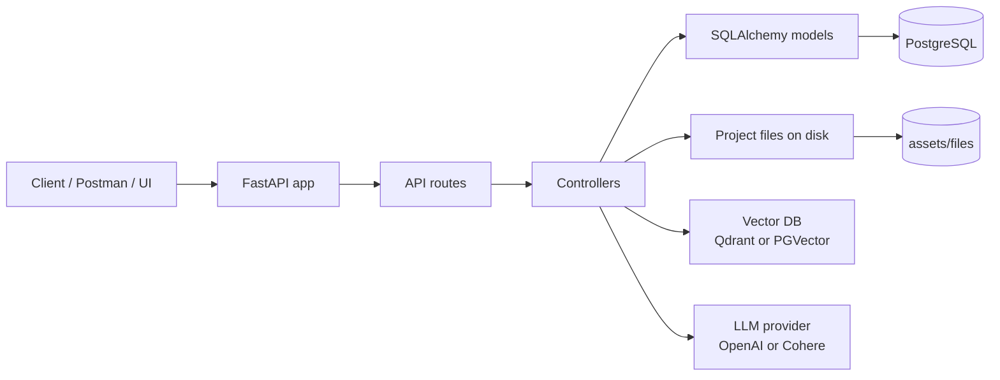
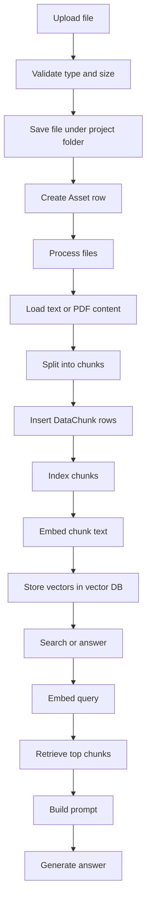
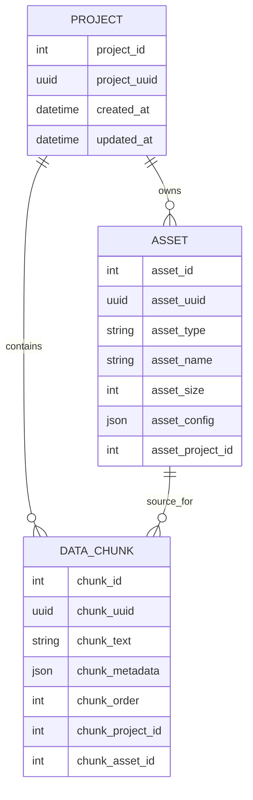

# mini-rag Project Overview

mini-rag is a minimal retrieval-augmented generation backend.
It keeps documents in a local project folder, records metadata in PostgreSQL,
stores chunks in a vector database, and uses an LLM to answer questions from
the most relevant retrieved chunks.

## Big Picture

## Request Flow

## Data Model

## API Summary

| Method | Path | What it does | Why it exists |
| --- | --- | --- | --- |
| GET | `/api/v1/` | Returns app name and version | Simple health-style entry point and metadata check |
| POST | `/api/v1/data/upload/{project_id}` | Uploads a `.txt` or `.pdf` file and creates an asset record | Starts the document ingestion flow |
| POST | `/api/v1/data/process/{project_id}` | Loads uploaded files, chunks them, and stores chunk rows | Prepares documents for retrieval |
| POST | `/api/v1/nlp/index/push/{project_id}` | Embeds chunks and writes them into the vector database | Builds the semantic search index |
| GET | `/api/v1/nlp/index/info/{project_id}` | Returns vector collection details | Lets you inspect whether indexing succeeded |
| POST | `/api/v1/nlp/index/search/{project_id}` | Searches the vector DB with a query | Retrieves the most relevant chunks |
| POST | `/api/v1/nlp/index/answer/{project_id}` | Searches and then generates an LLM answer | Provides the full RAG question-answer flow |

## Endpoint Details

### GET `/api/v1/`

Returns:
- `app-name`
- `app-version`

Purpose:
- Confirms the service is running
- Gives the caller the configured application identity

### POST `/api/v1/data/upload/{project_id}`

Input:
- `file` as `UploadFile`
- `project_id` in the path

What it does:
- Creates the project record if it does not exist
- Validates file type and file size
- Saves the file in the project folder
- Creates an `Asset` row with file metadata

Reads/Writes:
- Reads settings for allowed types and max file size
- Writes to disk under `assets/files/{project_id}`
- Writes to PostgreSQL `assets`

Why it exists:
- It is the entry point for bringing source documents into the system

### POST `/api/v1/data/process/{project_id}`

Input:
- `file_id` optional
- `asset_type`
- `chunk_size`
- `overlap_size`
- `do_reset`

What it does:
- Finds files for the project
- Loads `.txt` or `.pdf` content
- Splits content into chunks
- Writes `DataChunk` rows
- Optionally clears existing chunks and vector data first

Reads/Writes:
- Reads files from disk
- Reads and writes PostgreSQL `chunks`
- May delete the vector collection when `do_reset` is enabled

Why it exists:
- It converts uploaded files into structured retrieval units

### POST `/api/v1/nlp/index/push/{project_id}`

Input:
- `do_reset`

What it does:
- Creates the vector collection if needed
- Embeds each chunk
- Inserts vectors into Qdrant or PGVector

Reads/Writes:
- Reads PostgreSQL `chunks`
- Writes to the vector database

Why it exists:
- It makes chunk content searchable by meaning, not just text match

### GET `/api/v1/nlp/index/info/{project_id}`

What it does:
- Returns the vector collection info for the project

Reads/Writes:
- Reads from the vector database only

Why it exists:
- It is a quick inspection endpoint for debugging and verification

### POST `/api/v1/nlp/index/search/{project_id}`

Input:
- `text`
- `limit`

What it does:
- Embeds the query
- Searches the vector DB
- Returns the top matching chunks with scores

Reads/Writes:
- Reads the vector database
- Does not write data

Why it exists:
- It exposes semantic retrieval without generating a final answer

### POST `/api/v1/nlp/index/answer/{project_id}`

Input:
- `text`
- `limit`

What it does:
- Searches for relevant chunks
- Builds a prompt from the retrieved context
- Sends the prompt to the generation model
- Returns the answer, prompt, and chat history

Reads/Writes:
- Reads the vector database
- Reads chunk text from the retrieval layer
- Calls the generation backend
- Does not write persistent data

Why it exists:
- It is the main user-facing RAG endpoint

## Key Components

- `ProjectController` creates the project folder path
- `DataController` validates uploads and generates safe file names
- `ProcessController` loads and chunks source files
- `NLPController` handles embedding, vector search, and answer generation
- `ProjectModel`, `AssetModel`, and `ChunkModel` handle PostgreSQL records
- `LLMProviderFactory` selects OpenAI or Cohere
- `VectorDBProviderFactory` selects Qdrant or PGVector

## Notes

- The app currently supports `.txt` and `.pdf` files.
- Project records are created lazily when a request needs them.
- The vector collection name includes the embedding size and project id.
